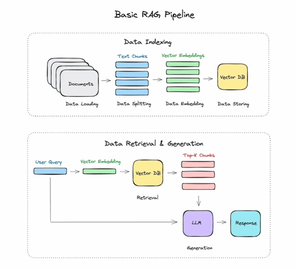

## Spring AI가 무엇일까?

Spring 개발자들을 위한 LLM 통합 도구로 OpenAI, Anthropic 같은 다양한 벤더 모델들을
하나의 공통된 방식으로 다룰 수 있게 도와주는 프레임워크이다.

Spring은 다양한 외부 라이브러리의 기능을 쉽게 사용할 수 있도록 컴포넌트를 제공해준다.
Spring AI도 컴포넌트를 통해, 모델 호출을 간단하게 처리할 수 있다.
설정도 application.yml에 간단히 추가하는 것으로 끝난다.

OpenAI GPT 모델을 사용하다가 Anthropic Claude 모델로 바꾸고 싶은 경우,
Spring AI를 사용하면, application.yml에서 모델 벤더와 모델 이름만 바꿔주면 된다.
벤더마다 다른 API를 쓰지 않아도 되어, 일관된 방식으로 모델을 사용할 수 있다.

Spring AI는 텍스트를 청크로 나누고, 벡터화까지 하는 RAG 기능도 제공해준다.
추상화또한 잘 되어 있어서, 확장에 유연하다.

커뮤니티도 활발해서 MCP, Function Calling, Prompt Template 기능들도 지원한다.

## Spring AI 추상화 방식과 구조

### Prompt와 ChatOptions

`Prompt` 클래스는 Spring AI에서 모델에 보낼 메시지 `Message`와 모델 파라미터 옵션 `ChatOptions을 감싸는 역할을 한다.

```java
public class Prompt implements ModelRequest<List<Message>> {
    private final List<Message> messages;
    private ChatOptions modelOptions;

    @Override
    public ChatOptions getOptions() {...}

    @Override
    public List<Message> getInstructions() {...}
}
```

ChatOptions은 LLM 호출 시 사용할 다양한 파라미터를 정의한 인터페이스로 대부분의 LLM에서
공통으로 사용될 수 있는 옵션들만 포함하고 있다.

```java
public interface ChatOptions extends ModelOptions {
    String getModel();

    Float getFrequencyPenalty();
    Integer getMaxTokens();
    Float getPresencePenalty();
    Float getTemperature();
    Float getPresencePenalty();
    List<String> getStopSequences();
    Float getTemperature();
    Integer getTopK();
    Float getTopP();

    ChatOptions copy();
}
```

`ChatOptions`가 제공하는 속성은 벤더 간 자동 변환된다.
예를 들어, OpenAI의 `stop`과 Anthropic의 `stop_sequences`는 `ChatOptions`의 `getStopSequences()`로 매핑되어,
Spring AI가 알아서 처리한다.

```java
import org.springframework.ai.chat.prompt.ChatOptions;

val openAIChatOptions = ChatOptions.builder()
        .model("gpt-3.5-turbo")
        .temperature(0.7)
        .stopSequences(listOf("\n")) // Open AI의 'stop' 매개변수로 자동 변환
        .build();

val anthropicChatOptions = ChatOptions.builder()
        .model("claude-3-7-sonnet")
        .temperature(0.7)
        .stopSequences(listOf("\n")) // Anthropic의 'stop_sequences' 매개변수로 자동 변환
        .build();
```

> 단, 정의되지 않은 추가 옵션(`seed`, `logitBias` 등)들은 직접 매핑이 필요하다. 

### ChatModel

Spring AI는 `ChatModel`이라는 핵심 컴포넌트를 기반으로 작동한다.
`ChatModel`은 LLM과의 상호작용을 담당하는 인터페이스이다.

```java
public interface ChatModel extends Model<Prompt, ChatResponse> {
    default String call(String message) {...};
    
    @Override
    ChatResponse call(Prompt prompt);
}
```

`ChatModel` 인터페이스를 구현한 클래스는 `ChatResponse`라는 공통된 응답 객체를 반환한다.
이 안에는 모델의 출력 메시지 뿐만 아니라, 사용된 프롬프트, 모델 파라미터, 응답 시간 등의
메타 정보도 포함되어 있어서, 후처리나 로깅, 디버깅 시에도 유용하게 활용할 수 있다.

### 내부 동작 순서

Spring AI의 `ChatModel` 인터페이스를 구현한 클래스는 내부적으로 다음과 같은 과정을 거친다
1. 입력으로 받은 `Prompt`를 벤더의 API 형식에 맞게 변환한다.
2. 변환된 메시지를 사용하여 벤더의 API를 호출한다.
3. 벤더로부터 받은 응답을 `ChatResponse` 객체로 변환하여 반환한다.

## RAG의 필요성

LLM은 학습한 지식 내에서만 답변할 수 있다. 
특정 기업의 문서나 최신 법률처럼 외부 도메인 지식이 필요한 경우 할루시네이션이 발생할 수 있다.

RAG는 외부 데이터를 검색해 LLM에게 컨텍스트를 제공하는 방식으로, 
LLM이 최신 정보나 특정 도메인 지식에 대해 보다 정확하고 신뢰할 수 있는 답변을 생성할 수 있도록 도와준다.



데이터 인덱싱과 데이터를 조회해서 응답을 생성하는 두 가지 과정으로 나눌 수 있다.

먼저 Data Loading을 통해 학습시키고자 했던 문서들을 업로드하면,
문서들을 Data Splitting을 통해 적절한 크기로 청킹해서 청크들을 만든 후,
임베딩 모델로 Data Embedding해서 청크들을 벡터화한다. 
이렇게 벡터화된 청크들은 벡터 저장소에 Data Storing한다.

사용자가 질의를 하면 질의를 벡터화시킨다.
벡터 저장소에서 유사한 벡터들을 검색해서 유사한 청크들을 가져온다.
이렇게 가져온 청크들을 LLM에게 전달해서 최종 응답을 생성한다.

### 데이터 색인(Data Indexing)

문서 청킹(Chunking) 단계에서는 PDF 또는 텍스트 문서를 업로드하고, 텍스트를 추출 및 정제 한 후,
LLM이 이해하기 좋은 단위로 청킹(Text Splitting)한다.

### 질의응답 (Data Retrieval & Generation)

사용자의 프롬프트를 벡터화하고, 유사한 문서 청크를 검색하여 검색된 문서를 LLM에게 컨텍스트로 전달하여 최종 응답을 생성한다.

## Spring AI의 RAG 기능

RAG 시스템을 직접 구현하려면 텍스트 청킹 전략, 임베딩 모델 연동, 벡터 저장소 연동, 메타데이터 기반 필터링,
LLM 프롬프트 구성 및 요청 처리 등 다양한 요소들을 직접 작성해야 한다.

하지만 Spring AI는 이 복잡한 요소들을 표준화된 컴포넌트로 추상화해준다.

### Embedding Model - 텍스트를 벡터로 변화하는 인터페이스
LLM과 검색 시스템을 연결하는 첫 번째 단계는 임베딩입니다.
Spring AI는 EmbeddingModel 인터페이스를 통해 다양한 벤더의 임베딩 모델을 쉽게 연동할 수 있게 해준다.

```java
public interface EmbeddingModel extends Model<EmbeddingRequest, EmbeddingResponse> {
    EmbeddingResponse call(EmbeddingRequest request);
    default float[] call(String text);
    float[] embed(Document document);
    default List<float[]> embed(List<String> texts);
    default EmbeddingResponse embedForResponse(List<String> texts);
    default int dimensions();
}
```

```kotlin
val embeddingModel = OpenAiEmbeddingModel(
        openAiApi,
        MetadataMode.EMBED,
        OpenAiEmbeddingOptions.builder()
                .model(embeddingModel)
                .build(),
        RetryUtils.DEFAULT_RETRY_TEMPLATE
)

val embededText = embeddingModel.embed(text)
```

### TokenTextSplitter - 텍스트 분할 전략 내장

LLM은 긴 문서를 한 번에 처리하지 못하기 때문에, 문서를 적절한 길이로 나누는 작업이 필요하다.
Spring AI는 이를 위해 TextSplitter를 제공한다.

```java
public class TokenTextSplitter extends TextSplitter {
    protected List<String> doSplit(String text, int chunkSize);
}

public abstract class TextSplitter implements DocumentTransformer {
    public List<Document> split(List<Document> documents);;
    public List<Document> split(Document document);
}
```

```kotlin
val textSplitter = TokenTextSplitter().builder()
    .withChunkSize(500)
    .build()
val chunks = textSplitter.split(documents)
```